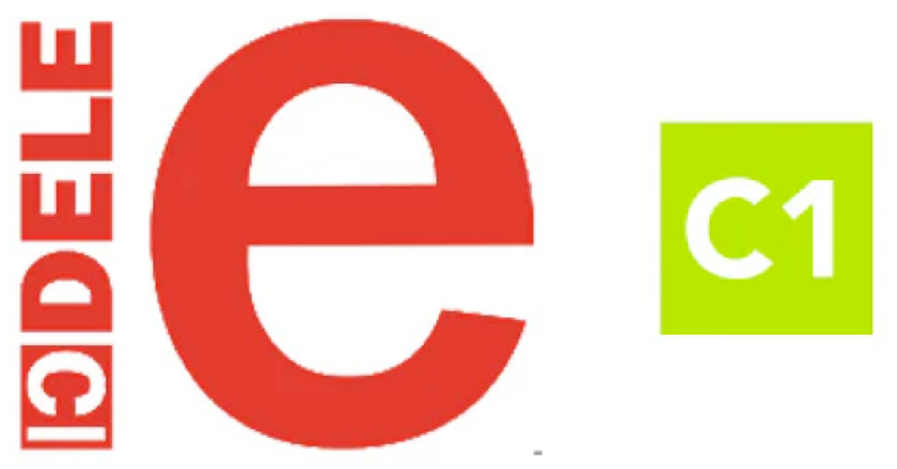

## Las Clases de Español de Adri

  

---

Hola Adri, y bienvenida a nuestro sitio web de clases de español.

Este es el sitio web de nuestras clases de español. Aquí encontrarás toda la información que necesitas para seguir tu viaje de aprendizaje del español con el objetivo de presentarte a la certificación DELE C1.

En esta pagina encontrarás:

- :calendar: El [calendario de clases](https://github.com/christoforos-nikolaou/SpanishClassWeb/blob/main/Calendario_de_clases.md#octubre-2025), con detalles sobre las cosas que aprendemos en cada clase y sesión.
- :notebook: Información sobre las [tareas y ejercicios](https://github.com/christoforos-nikolaou/SpanishClassWeb/blob/main/Tareas-y-ejercicios.md).
- :pencil: [Ejemplarios de ensayos](https://github.com/christoforos-nikolaou/SpanishClassWeb/blob/main/Ejemplarios_de_cartas_y_ensayos.md), cartas, articulos y trabajos escritos.
- :book: Notas y cuadernos de gramática.
- :headphones: Enlaces a los [recursos auditivos](https://github.com/christoforos-nikolaou/SpanishClassWeb/blob/main/Recursos_auditivos.md) que utilizamos en clase.
- :closed_book: Enlaces a [textos de literatura](https://github.com/christoforos-nikolaou/SpanishClassWeb/blob/main/Textos_adicionales.md), materiales de estudio y recursos útiles.
- :🇪🇸: Recursos adicionales para el aprendizaje del español.